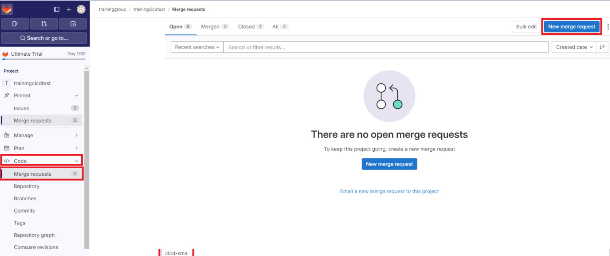
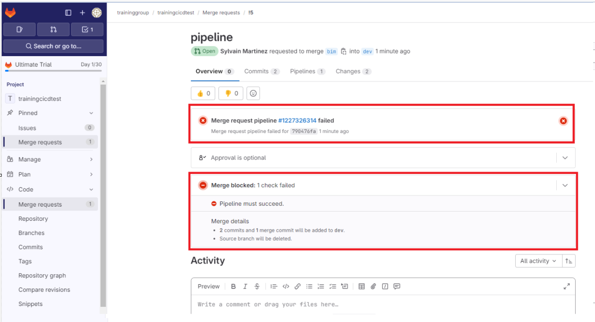
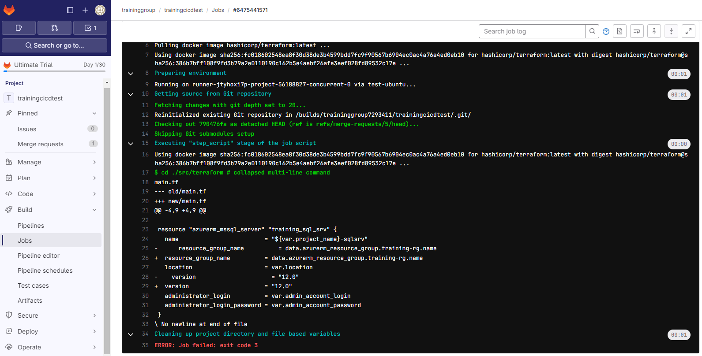
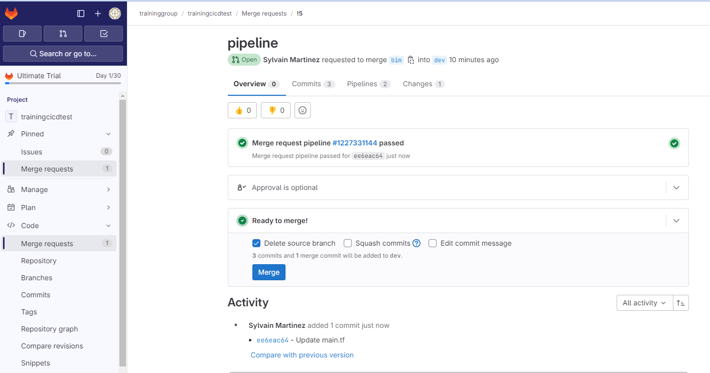
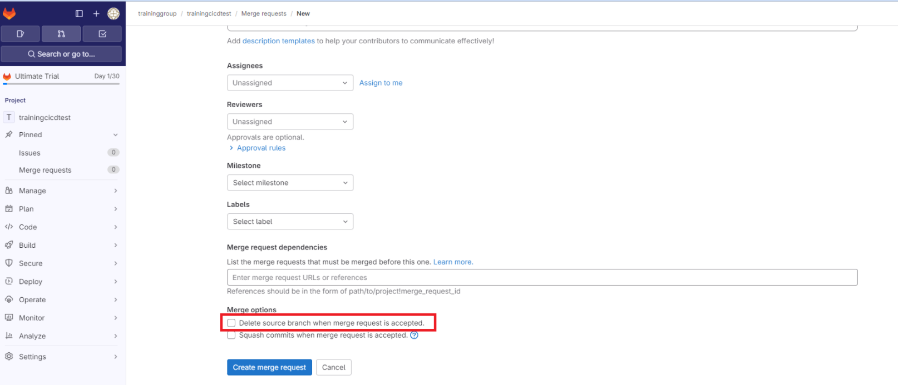
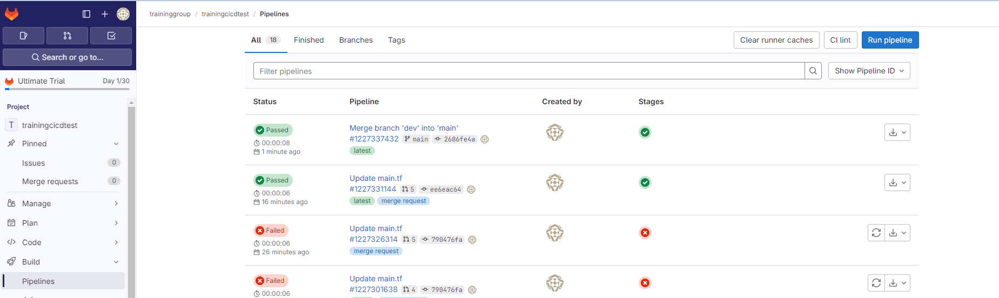
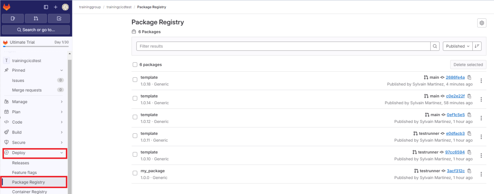

# Créer un pipeline de build

## Overview

Dans ce lab, vous allez créer un pipeline de build.

## Objectifs


A l'issu de ce lab, vous pourrez:

-   Créer un pipeline Gitlab avec le fichier *.gitlab-ci.yml*.
-   Effectuer des tests lors d'une Merge Request.
-   Produire un artefact pouvant être déployé dans un pipeline de release.

## Instructions

### Avant de commencer

- Le runner associé à votre projet est disponible.

### Exercice 1: Créer une nouvelle branche et ajouter la configuration des pipelines

Nous allons utiliser un repository existant et l'importer dans Gitlab.

Sur votre machine, dans le dossier contenant le repository git cloné, créez une nouvelle branche *pipeline*.

```powershell
git checkout -b pipeline
code .
```

Ajouter un nouveau fichier *.gitlabci.yml* à la racine du dossier.

> Toute la configuration des pipelines se fait à l'intérieur du fichier .gitlab-ci.yml, hormis des cas spécifiques comme un pipeline schédulé par exemple.

A l'intérieur de ce fichier, commencer par renseigner les variables par défaut

```yaml
default:
  tags:
    - {le tag associé a votre runner, qui est égale au nom du projet}
  image:
    name: hashicorp/terraform:latest
    entrypoint:
      - '/usr/bin/env'
      - 'PATH=/usr/local/sbin:/usr/local/bin:/usr/sbin:/usr/bin:/sbin:/bin'
```

> Ces variables par défaut s'appliqueront pour tous les jobs qui composeront le pipelines.

> Elles peuvent être modifiées locallement au niveau d'un job. La variable déclarée dans le job aura la précédence

> Les 2 variables par défaut sont tags et image. Tags permet d'identifier le runner qui sera utilisé pour exécuter les jobs. Image permet de définir l'image par défaut qui sera utilisée.

Rajoutez le premier job de ce pipeline

```yaml
test-job:
  stage: test
  script: |
    cd ./src/terraform
    terraform fmt -recursive -check -diff
  rules:
    - if: '$CI_MERGE_REQUEST_TARGET_BRANCH_NAME == "dev"'
```

> Ce job permet de vérifier l'indentation des fichiers terraform.

> Il est associé au stage test

> rules permet de configurer les règles de déclenchement de ce job. la rule renseingée indique que ce job doit être éxécuté lors qu'une Merge Request est créée avec comme destination la branch dev

Rajouter ensuite le deuxième job de ce pipeline

```yaml
build-job:
  stage: build
  script: |
    apk add --update zip curl
    zip -r template.zip ./src ./configuration
    curl --header "JOB-TOKEN: $CI_JOB_TOKEN" --upload-file template.zip "${CI_API_V4_URL}/projects/${CI_PROJECT_ID}/packages/generic/template/1.0.${CI_PIPELINE_IID}/template.zip"
  rules:
    - if: $CI_COMMIT_BRANCH == 'main'
```

> Ce job permet de produire un artefact. Cette artefact sera stocké dans la registry de package générique de gitlab.

> La publication se fait en utilisant l'api de gitlab. On s'authentifie avec un le token $CI_JOB_TOKEN. Cette variable d'environnement est automatiquement injecté par gitlab.

> Le versionning est fait en utilisant une autre variable d'environnement, $CI_PIPELINE_IID, qui correspond au numéro de pipeline, scopé au projet.

> la rule associé permet d'indiquer que ce job ne doit se déclencher que lors d'un commit sur la branche main

Ouvrez n'importe quel fichier *.tf* et modifier l'indentation.

> Le but de cette modification est de bloquer la Merge Request

Commitez ces modifications

```
git add .
git commit -m "add pipeline"
git push --set-upstream origin pipeline
```

### Exercice 2: Créer une Merge request vers la branche dev

Dans cette exercice, vous allez créer une nouvelle Merge Request de la branche *pipeline* vers la branche *dev*.

Dans l'interface Gitlab, allez dans partie *Code* -> *Merge Request* et créez une nouvelle Merge Request



Selectionnez la branche *pipeline* en tant que branche source et la branche *dev* en tant que target, puis cliquez sur *Compare branche and continue*.

Laissez les options par défaut et cliquer sur *Create merge request*.

Une fois la Merge request créée, le pipeline se déclenche et échoue.

> Ce comportement est normal, suite a la modification faite sur le fichier .tf



> Si la Merge Request n'est pas bloquée, verifiez que vous avez activer l'option Pipelines must succeed dans la configuration des Merge Requests

Ouvrez le pipeline en cliquant sur le lien qui affiche son ID, puis cliquez sur le job *test-job*.

Les logs indiquent la raison de l'erreur



Corriger l'indentation, créer un commit, et pousser le sur gitlab.

Le pipeline associé est lancé de nouveau, et finit cette fois en succès.



Vous pouvez la valider en cliquant sur *Merge*.

### Exercice 2: Créer une Merge request vers la branche main

Dans cette exercice, vous allez créer une nouvelle Merge Request de la branche *pipeline* vers la branche *dev*.

Dans l'interface Gitlab, allez dans partie *Code* -> *Merge Request* et créez une nouvelle Merge Request


Selectionnez la branche *pipeline* en tant que branche source et la branche *dev* en tant que target, puis cliquez sur *Compare branche and continue*.

Avant de créer la Merge Request, décochez la case *Delete source branch when merge request is accepted.*



> La branche dev est une branche persistente, contrairement à la branche de feature précédente.

Validez le merge.

La validation du merge provoque commit sur le branche *main* et donc déclenche le job de création d'un artefact.

Dans partie *Build* -> *pipeline*, le premier job qui s'affiche est celui déclenché suite à l'ajout de code sur la branche *main*.



Les logs indique qu'une nouvelle version du package est disponible.

Dans la partie *Deploy* -> *Package registry*, vérifier qu'un package est bien disponbile.


