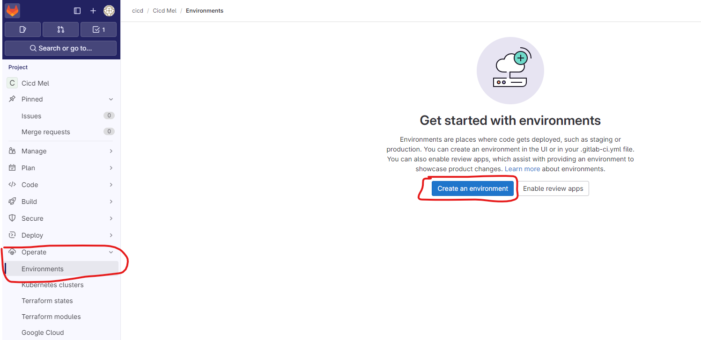
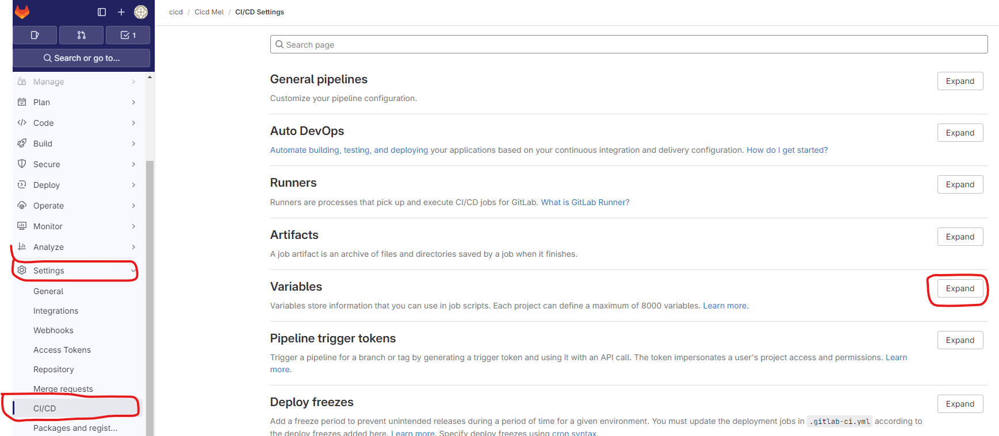
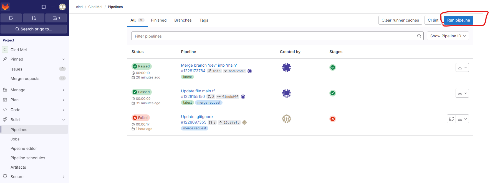

# Créer un pipeline de release

## Overview

Dans ce lab, vous allez créer un pipeline de release.

## Objectifs


A l'issu de ce lab, vous pourrez:

-   Déployer un artefact produit par un pipeline de build.

## Instructions

### Avant de commencer

- Un artefact est déployé dans la registry de package de gitlab.

### Exercice 1: Créer l'environnement de dev dans gitlab

Rajoutez un nouvelle environnement *DEV* dans l'interface de gitlab



### Exercice 2: Créer une nouvelle branche et ajouter la configuration du pipeline de release

Créer une nouvelle branche *release*.

> Toute la configuration des pipelines se fait à l'intérieur du fichier .gitlabci.yml, hormis des cas spécifiques comme un pipeline schédulé par exemple.

Dans le fichier *.gitlab-ci.yml*, tout au début, ajouter une variable

```yaml
variables:
  version: "1.0.0"
```

> Cette variable sera a renseignée lors de l'éxecution du pipeline de release

> Elle correspond à la version du package généré par le pipeline de build.

Rajoutez le job de plan sur l'environnement de *DEV*

```yaml
plan_dev:
  stage: deploy
  environment: "DEV"
  script: |
    apk add --update zip unzip curl wget
    wget -O template.zip --header="JOB-TOKEN: $CI_JOB_TOKEN" ${CI_API_V4_URL}/projects/${CI_PROJECT_ID}/packages/generic/template/${version}/template.zip
    unzip template.zip -d artifact
    cd artifact/src/terraform
    terraform init -backend-config=./../../configuration/dev/backend.hcl
    terraform plan -var-file=./../../configuration/dev/var.tfvars
  rules:
    - if: '$CI_PIPELINE_SOURCE == "web"'
      when: always
    - when: never

```

> Ce pipeline est déclenché manuellement.

> Il faudra lui fournir en entrée la variable version

> Ce job permet de consulter le plan

Rajoutez ensuite le job d'apply

```yaml
apply_dev:
  needs:
    - plan_dev
  environment: "DEV"
  stage: deploy
  script: |
    apk add --update zip unzip curl wget
    wget -O template.zip --header="JOB-TOKEN: $CI_JOB_TOKEN" ${CI_API_V4_URL}/projects/${CI_PROJECT_ID}/packages/generic/template/${version}/template.zip
    unzip template.zip -d artifact
    cd artifact/src/terraform
    terraform init -backend-config=./../../configuration/dev/backend.hcl
    terraform apply -var-file=./../../configuration/dev/var.tfvars -auto-approve
  when: manual
  rules:
    - if: '$CI_PIPELINE_SOURCE == "web"'
      when: manual
    - when: never

```

> Ce job permet d'effectuer l'apply de terraform

### Exercice 3: Mettre à jour le template

Mettez à jour le fichier de variables de l'environnement de dev, dans *configuration/dev/var.tfvars*

```powershell
resource_group_name = "votre groupe de ressource"
admin_account_login = "devadmindb"
project_name        = "un nom unique"
location            = "westeurope"
environment         = "dev"
```

### Exercice 4: Ajouter une variable pour le mot de passe du compte admin du serveur SQL

Ajouter une nouvelle variable.



Key : TF_VAR_admin_account_password
valeur : un secret de votre choix

### Exercice 5: Executer le pipeline de release

Depuis l'onglet Pipeline, executer un pipeline manuellement



Selectionnez la branche *release*

Indiquer une variable *version*, avec comme valeur la dernière version de package disponible.

Cliquez sur *Run pipeline*.

> L'opération de plan se déclenche

> Une fois le plan terminé, le job d'apply est disponbile. Il devra être lancé manuellement