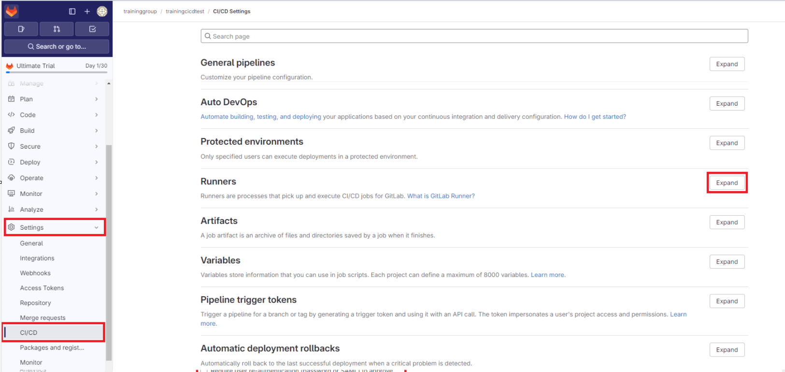
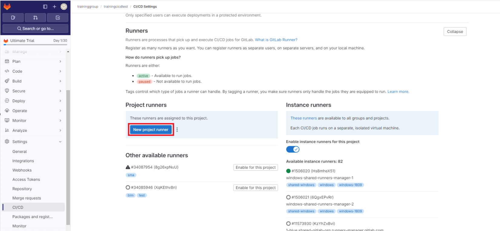
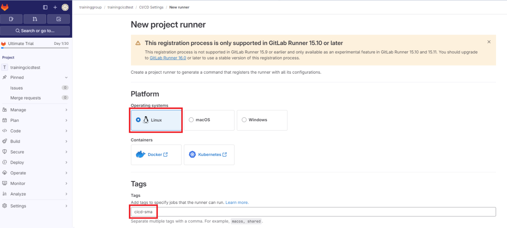
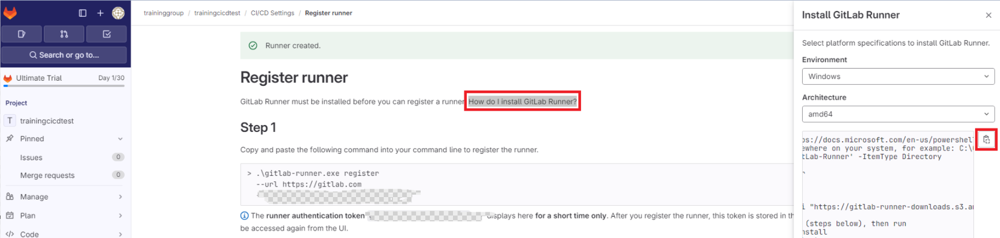
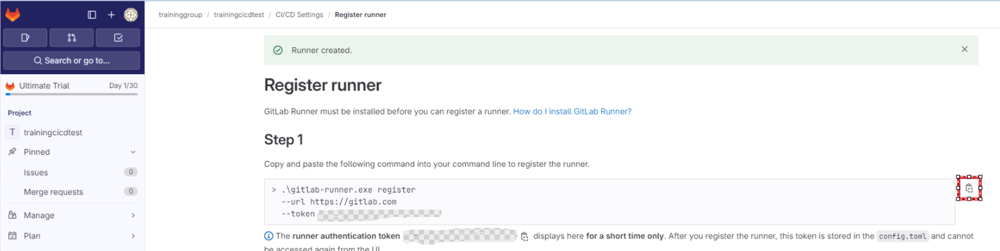
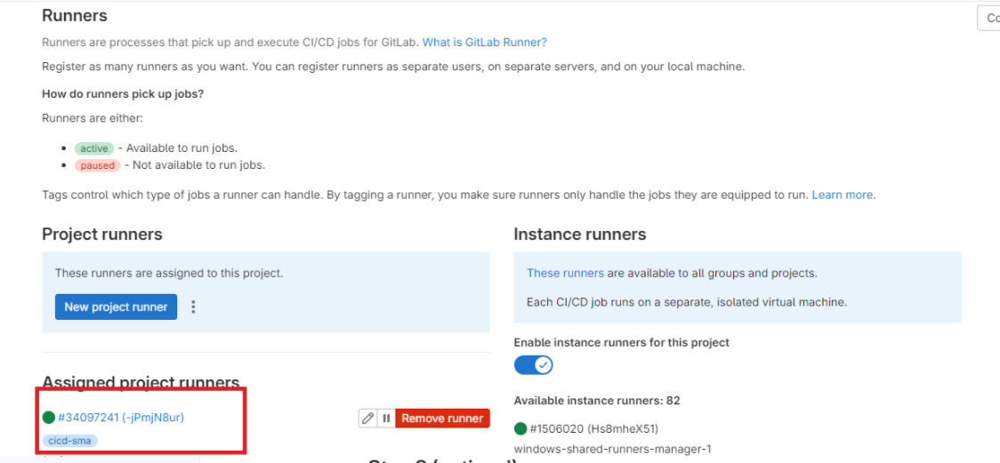

# Installer et configurer un runner gitlab

## Overview

Dans ce lab, vous allez configurer un runner gilab pour votre projet.

## Objectifs


A l'issu de ce lab, vous pourrez:

-   Utiliser le runner pour exécuter les pipelines de votre projet.

## Instructions

### Avant de commencer

- Vérifiez vos accès à la souscription et au groupe de ressources fournis pour ce training.
- Vérifiez vos accès au projet Gitlab fourni pour ce training.

### Exercice 1: Installer le runner gitlab

Dans le groupe de ressource fourni pour ce training, une VM est déjà présente. Nous allons installer le runner gitlab sur cette VM.

Connectez vous à la VM en utilisant le bastion.

Installer docker en utilisant le script suivant

```bash
# Add Docker's official GPG key:
sudo apt-get update
sudo apt-get install ca-certificates curl
sudo install -m 0755 -d /etc/apt/keyrings
sudo curl -fsSL https://download.docker.com/linux/ubuntu/gpg -o /etc/apt/keyrings/docker.asc
sudo chmod a+r /etc/apt/keyrings/docker.asc

# Add the repository to Apt sources:
echo \
  "deb [arch=$(dpkg --print-architecture) signed-by=/etc/apt/keyrings/docker.asc] https://download.docker.com/linux/ubuntu \
  $(. /etc/os-release && echo "$VERSION_CODENAME") stable" | \
  sudo tee /etc/apt/sources.list.d/docker.list > /dev/null
sudo apt-get update

sudo apt-get install docker-ce docker-ce-cli containerd.io docker-buildx-plugin docker-compose-plugin
```

Dans l'interface Gitlab, afficher les Runners



Cliquez sur New Projet Runner



Selectionnez Linux, et dans la liste des tags, ajoutez le nom de votre projet



Cliquez sur *Create runner*.

Dans l'écran suivant, cliquez sur *How do I install GitLab Runner?* et copier le script qui apparait sur la droite.



Executez le script récupéré précedement sur la VM.

Retourner sur l'interface Gitlab et copier le script de l'étape 1.



Executer ce script (en sudo) sur la VM

> Pour l'url de l'instance Gitlab, laissez la valeur par défaut (https://gitlab.com)

> Pour le nom du runner, laissez la valeur par défaut (hostname de la machine)

> Pour l'executor, tapez docker et confirmez

> Pour l'image par defaut, saisissez ruby:3.1

De retour sur l'interface Gitlab, cliquez sur *View runners*.

Vérifiez que le runner est bien disponible.



