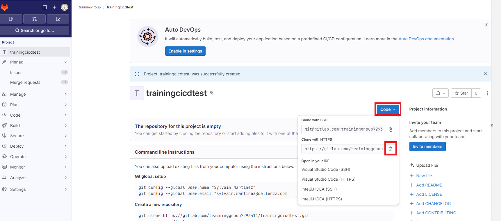
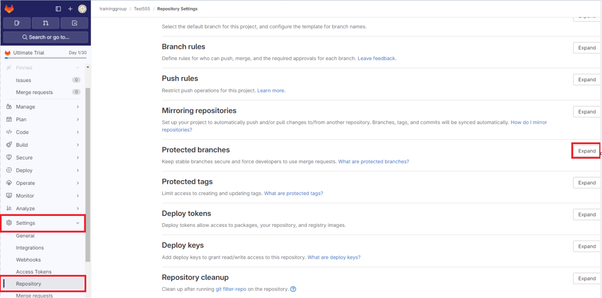
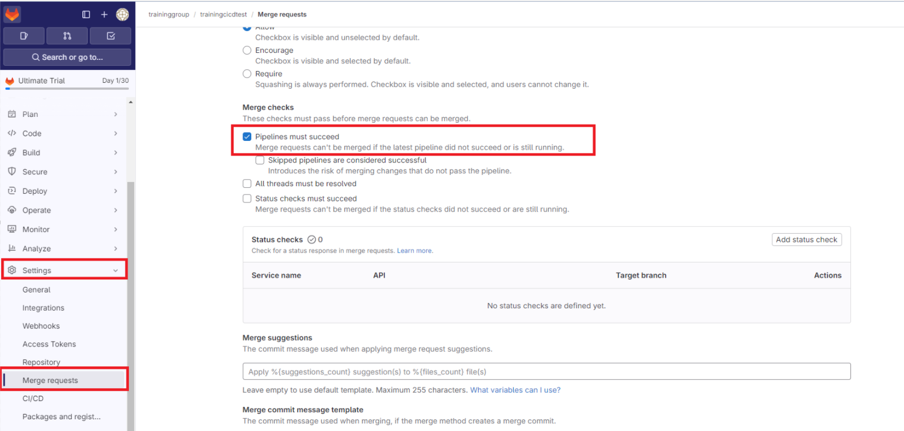
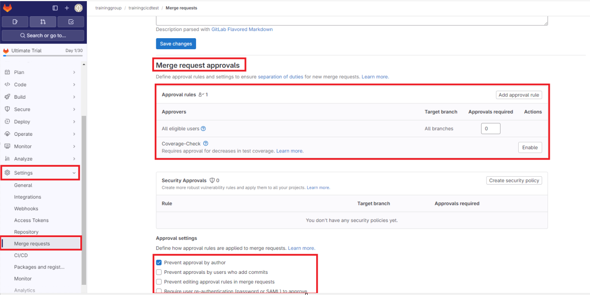

# Gérer un template Terraform dans un repository Gitlab

## Overview

Dans ce lab, vous allez utiliser le contrôle de code source pour un template Terraform.

## Objectifs


A l'issu de ce lab, vous pourrez:

-   Utiliser le contrôle de code source pour un template Terraform.

## Instructions

### Avant de commencer

- Vérifiez vos accès à la souscription et au groupe de ressources fournis pour ce training.
- Vérifiez vos accès au projet Gitlab fourni pour ce training.
- Avoir git installé sur sa machine
- En utilisant le portail Azure, créez un compte de stockage avec un container **tfstates**. Nous allons l'utiliser comme backend pour le fichier tfstate.

### Exercice 1: Importer un repository Git

Nous allons utiliser un repository existant et l'importer dans Gitlab.

Créez un dossier de travail.

```powershell
mkdir trainingcicdgitlab
cd trainingcicdgitlab
```

Clonez le repository de base

```powershell
git clone https://github.com/smartinez-cellenza/training-terraform-cicd-base.git
cd .\training-terraform-cicd-base\
```

> Ce repository contient un exemple de projet Terraform.

> Le dossier *sr* contient un template au format canonique.

> Le dosser *configuration* contient la configuration (variables et backend) pour 3 environments.

Vous allez pousser ce repository sur Gitlab.
Récupérer la clone Url (https) depuis l'interface gitlab.



et lancez les commandes suivantes

```
git remote rename origin old-origin
git remote add origin {{clone url}}
git push --set-upstream origin --all
```

### Exercice 2: Créer une branche

Dans cette exercice, vous allez créer une nouvelle branche *dev*.

Lancez la commandes suivante :

```powershell
git checkout -b dev
```

Dans le dossier *configuration*, mettez à jour le fichier **backend.hcl** pour chaque environnement. Mettez à jour les champs *resource_group_name* et *storage_account_name* pour correspondre au compte de stockage que vous avez créer précédement.

Ajoutez ces fichier dans la zone de staging.

```powershell
git add .
```

Créez un nouveau commit

```powershell
git commit -m "update backend configuration"
```

Poussez vos modification vers gitlab

```powershell
git push --set-upstream origin dev
```

### Exercise 3: Protéger la branche main

Dans l'interface gitlab, sur votre projet, selectionnez *Settings* -> *Repository* puis expand sur l'onglet *Protected branch*



> les différentes options permettent d'interdire l'écriture directe sur la branche main (ou d'autres) et forcent l'utilisation d'une Merge Request.

Dans l'interface gitlab, sur votre projet, selectionnez *Settings* -> *Merge Request*.

Dans la section *Merge checks*, cochez la case *Pipelines must succeed* et sauvegarder.



> Une Merge Request ne pourra pas être validé si un pipeline déclenché par la création d'une Merge Request n'est pas au statut success.

Dans la section *Merge checks*, vous pouvez également configurer une liste d'approbateurs pour pouvoir valider une Merge Request.



> Dans un scénario réel, vous devriez configurer ces options. Dans ce lab, vous travaillerez seul. Afin de ne pas être bloqué, ne configurer pas d'approbation.